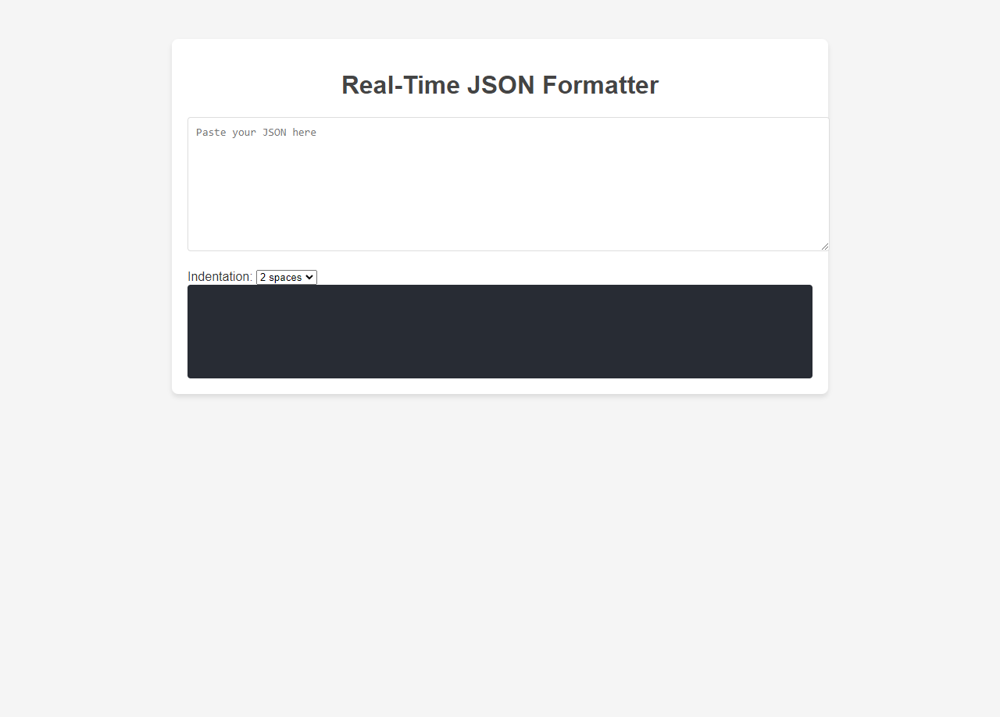

# Real-Time JSON Formatter
A lightweight, web-based tool to format, validate, and visualize JSON data. This tool is designed for developers who need quick and accurate JSON formatting with customizable indentation settings.

## **Features**
- **JSON Formatting**: Automatically formats JSON with proper indentation.
- **Syntax Highlighting**: Color-coded visualization for keys, values, and data types.
- **Error Highlighting**: Displays JSON syntax errors with clear messages.
- **Custom Indentation**: Select the number of spaces for indentation (e.g., 2, 4, 6, or 8 spaces).

## **Demo**
- [Live Website](https://velimirpaleksic.github.io/real-time-json-formatter/)

## **How to Use**
1. Open the `index.html` file in your browser.
2. Paste or type your JSON data into the input text area.
3. Select the desired indentation level from the dropdown menu.
4. View the formatted JSON in real-time in the output section.
5. If there are errors in your JSON, an error message will appear below the output.

## **Contact** ✉
- E-mail: [velimir.paleksic@gmail.com](velimir.paleksic@gmail.com).
- VexSystems GitHub: [github.com/vexsystems](https://github.com/vexsystems).
- VexSystems Instagram: [@vex.systems](https://www.instagram.com/vex.systems/).